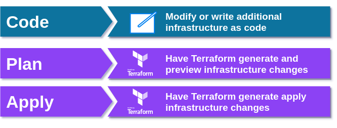
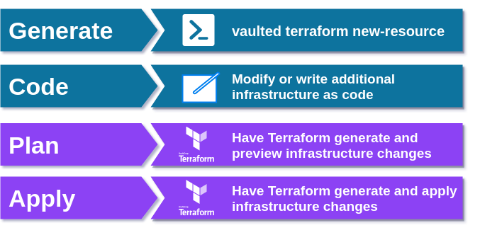

# terraform-provider-vaulted

[](https://travis-ci.org/sumup-oss/terraform-provider-vaulted)

[](https://goreportcard.com/report/github.com/sumup-oss/terraform-provider-vaulted)

A terraform provider that utilizes https://github.com/sumup-oss/vaulted to provide 
 https://github.com/hashicorp/terraform for https://github.com/hashicorp/vault encrypted secrets via 
  `resource.vaulted_vault_secret` that:
  
* are **never** stored as plaintext in your terraform state.
* are **never** logged in stdout as plaintext.
* can be **safely** stored in SCM such as Git in their encrypted payload format produced by https://github.com/sumup-oss/vaulted .

Tested and used against https://github.com/hashicorp/vault official docker image versions:

* `0.9.x`,
* `0.11.6`,
* `1.0.3`,
* `1.1.0`,
* latest

Check [magefile.go](./magefile.go) for up-to-date info what the test suite matrix uses.

Also shown at https://medium.com/@syndbg/provisioning-vault-encrypted-secrets-using-terraform-using-sumup-oss-vaulted-and-4aa9721d082c?source=friends_link&sk=9eabe1bbe6ba089fe176d94cf413862d

## Typical Terraform workflow



## Terraform workflow with usage of https://github.com/sumup/vaulted and this provider



## Installation

1. Download latest GitHub release locally for your OS and architecture.
2. Follow https://www.terraform.io/docs/configuration/providers.html#third-party-plugins
3. Move downloaded release binary to local terraform plugin dir.

E.g installation on a Linux AMD64 host

```
# Assuming we already downloaded the binary at ~/Downloads/terraform-provider-vaulted_v0.4.0_linux_amd64
> mkdir -p ~/.terraform.d/plugins/linux_amd64
> mv ~/Downloads/terraform-provider-vaulted_v0.4.0_linux_amd64 ~/.terraform.d/plugins/linux_amd64/terraform-provider-vaulted_v0.4.0
```

And we're ready to use it!

## [Use cases](./USE_CASES.md)

## [Usage](./USAGE.md)

## [Contributing](./CONTRIBUTING.md)

## [FAQ](./FAQ.md)

## About SumUp

[SumUp](https://sumup.com) is a mobile-point of sale provider.

It is our mission to make easy and fast card payments a reality across the *entire* world. 

You can pay with SumUp in more than 30 countries, already. 

Our engineers work in Berlin, Cologne, Sofia and Sāo Paulo. 

They write code in JavaScript, Swift, Ruby, Go, Java, Erlang, Elixir and more. 

Want to come work with us? [Head to our careers page](https://sumup.com/careers) to find out more.
